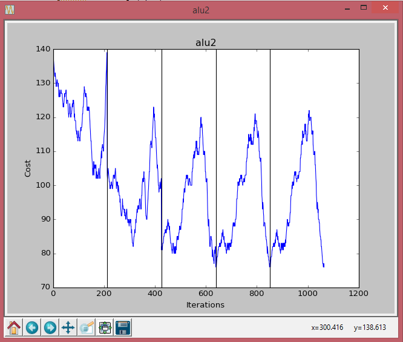
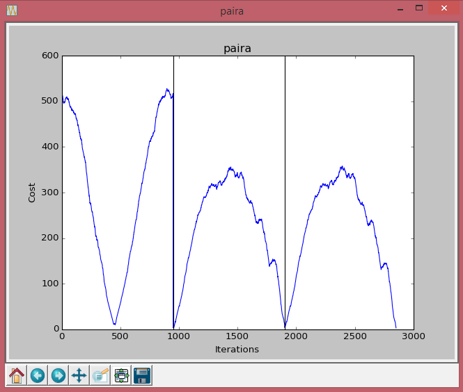
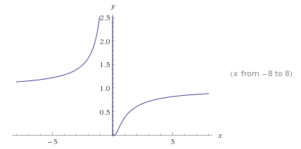
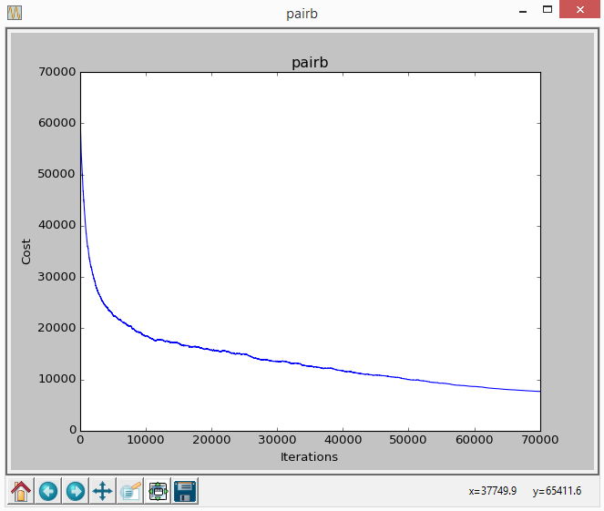
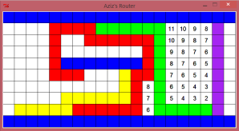
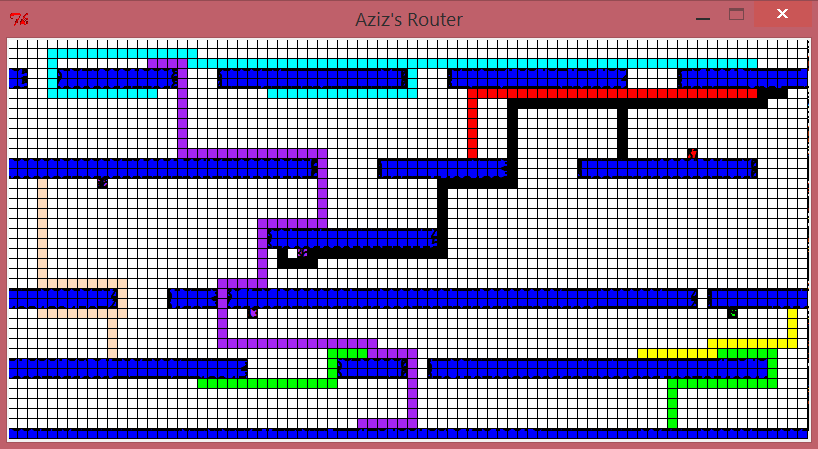

# CAD Algorithms for Integrated Circuits

- This repository contains my implementations of the following CAD algorithms:
    - Partitioning
    - Placement
    - Routing

## Partitioning

This is an enhanced version of the Kernighan-Lin/Fiduccia-Mattheyses bi-partitioning algorithm, studying the impact of adjusting initial placements, gain functions, and exit strategies, and optimizing for cut-size.

### Efficiency

1. One of the main improvements was applying dynamic programming, by calculating the Gain incrementally in each iteration (instead of calculating the gain for all cells every time). The gain is calculated for only the cells that are impacted by the move. For one of the benchmarks, calculating the total gain every time resulted in 43 seconds of runtime, compared to less than 1 second using dynamic programming.

2. If two passes return the same best cut-size, the algorithm will never generate better results by running longer. So I implemented an exit strategy; instead of doing 6 passes for each benchmark, if two consecutive passes return the same best cut-size, the algorithm exits. This dropped the total runtime by about 40%.

3. When starting any benchmark, a lot of data is generated/manipulated at the beginning to make data more accessible during the partitioning process. Some of this data is: netsOfBlock[][],blocklist[][],netlist[],gainOfBlock[], location[], and so on. Most of this data is redundant. They do take extra space, but it is a small trade off compared to the increase in speed (O(1) access time compared to O(n) for most).

### GUI

I created a simple GUI that plots Cost (Cut-size) vs. Iterations per benchmark.

The vertical lines represent divisions between different passes (the number of passes differ, with a maximum of 6 passes)

### Results

| Benchmark           | Runtime (Seconds) | Cut-size |
|---------------------|-------------------|----------|
| alu2                | 1.400             | 76       |
| apex1               | 9.722             | 103      |
| apex4               | 43.088            | 208      |
| C880                | 0.741             | 15       |
| cm138a              | 0.005             | 2        |
| cm150a              | 0.010             | 1        |
| cm151a              | 0.003             | 1        |
| cm162a              | 0.010             | 9        |
| cps                 | 10.405            | 137      |
| e64                 | 1.866             | 102      |
| paira               | 6.621             | 3        |
| **Overall Average** | **73.9**          | **59**   |

## Placement

This is a Cell Placement tool based on Simulated Annealing optimization algorithm.

### Efficiency

1. One of the main improvements was calculating the cost incrementally in each iteration (instead of calculating the total cost every time). To do this, I created two lists: netsOfBlock[block_num][nets_related_to_block], costOfNet[net_num]. When doing a swap, the updateCostOfSwap() function is called. It basically retrieves the nets related to the swapped blocks (netsOfBlock[][]), calculates the cost of these nets after swapping, then compares it with the previous cost of these nets (which is saved in costOfNet[]). If the move is taken, the new cost is committed in costOfNets[] for the related nets. This incremental cost calculation improved efficiency significantly. For one of the benchmarks, calculating the total cost every time resulted in 2539 seconds of runtime, compared to 166 seconds after implementing incremental cost.

2. I used the Range Window method. It starts at ¼ the size of the grid, and gets smaller as the temperature decreases (1/4 was chosen after tuning).

3. The number of iterations in the inner loop is not fixed. It increase as T decreases, especially at the end. I decided to do this after studying the e(-deltaCost/T) graph:

The temperature range is from 7 to 0.0001. When deltaCost = 1, T=1, wrong moves are picked 36% of the time. From 1 to 0 is where the algorithm starts getting picky, and I needed more iterations there.

4. The swapping function initially picked two blocks at random. Two empty blocks were chosen sometimes. This resulted in wasted iterations. To fix this, I ensured that the first block is actually for a cell. The second block is chosen randomly (within a Range Window, as explained in point 2).

5. When starting any benchmark, a lot of data is generated/manipulated at the beginning to make data more accessible during the simulated annealing process. Some of this data is: netsOfBlock[][],blocklist[][],netlist[],costOfNet[], gird[][], location[][], and so on. Most of this data is redundant. They do take extra space, but it is a small trade off compared to the increase in speed (O(1) access time compared to O(n) for most).

### GUI

The GUI plots Cost vs. Iterations. Instead of making the update happen in real time, the code collects data while running the simulated annealing algorithm, and displays a graph at the end of each benchmark.

### Results

| Benchmark           | Runetime (Seconds) | Cost     |
|---------------------|--------------------|----------|
| alu2                | 105.35             | 1204     |
| apex1               | 122.30             | 8659     |
| apex4               | 260.38             | 17374    |
| C880                | 60.22              | 1431     |
| cm138a              | 30.81              | 47       |
| cm150a              | 31.30              | 88       |
| cm151a              | 25.03              | 46       |
| cm162a              | 29.14              | 103      |
| cps                 | 193.30             | 7577     |
| e64                 | 56.11              | 2562     |
| paira               | 65.56              | 7214     |
| pairb               | 58.95              | 7267     |
| **Overall Average** | **1038.44**        | **4464** |

## Routing

This is a Router based on Lee-Moore (Dijkstra) Shortest Path Algorithm, expanded it to handle multiple wires and sinks.

### GUI

The GUI displays the routing algorithm as it progresses.

